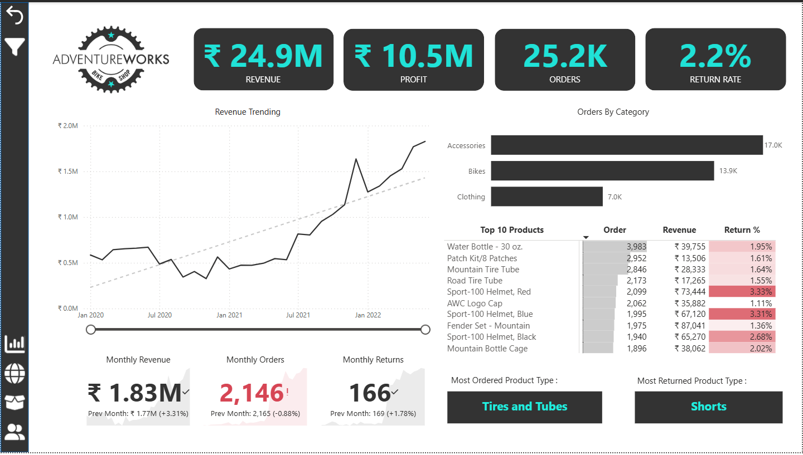
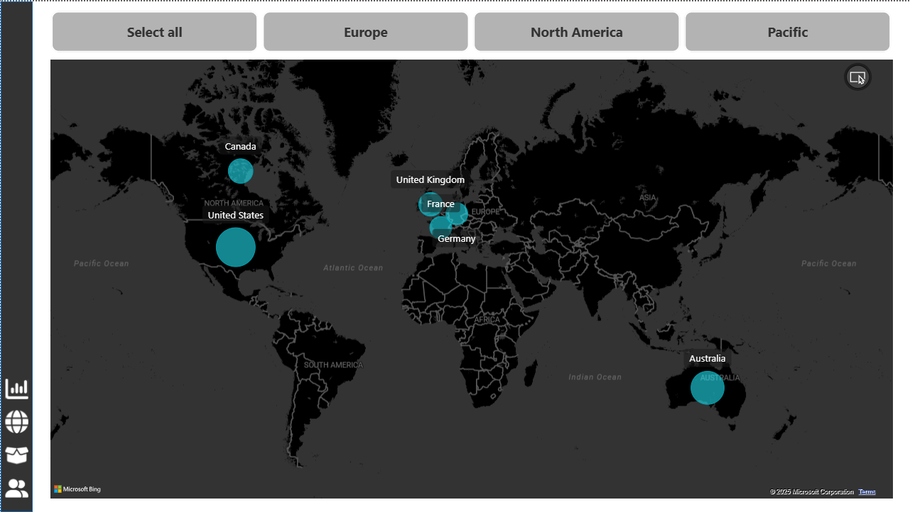
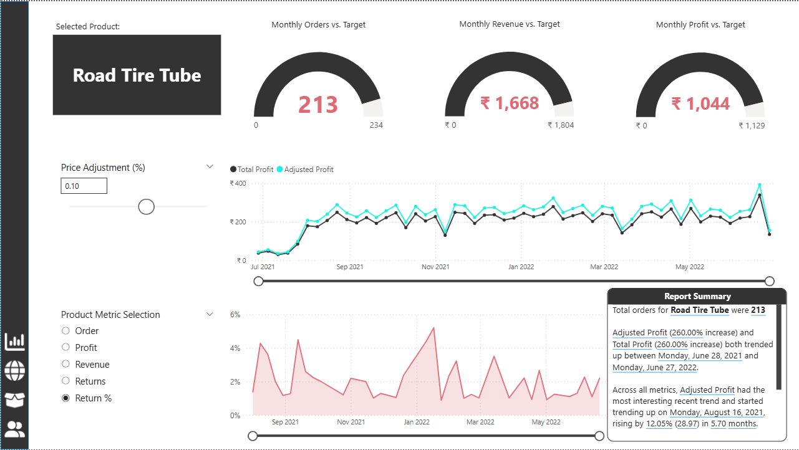
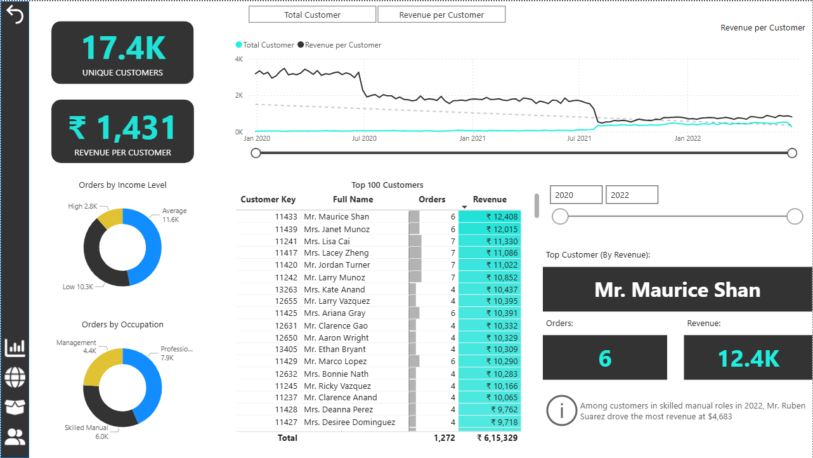

# AdventureWorks Sales & Customer Insights | Power BI

## Project Overview
This project is an end-to-end Power BI business intelligence solution built using AdventureWorks sales data.
The goal is to transform raw transactional data into a clean analytical model to solve business problems like high return rates and identify customer sales trends.

## 📂 Project Documentation
* 📄 **[Full Project Report & Strategic Recommendations](./Adventureworks_Sales_Insights_Report.md)** – *Read the complete analysis, insights, and business recommendations.*
* 💼 **[Business Requirements Document (BRD)](./Business%20Requirements%20Document.md)** – *View the initial project scope and stakeholder requirements.*
* 🧮 **[DAX Measures Code](./DAX_Measures.md)** – *View the raw DAX formulas used for complex calculations.*

## Business Problem
The company lacked visibility into:
* Real-time sales and profit trends.
* High return rates on specific products (specifically Accessories).
* Customer demographics and their purchasing power.

## Dashboard Visuals

<table>
  <tr>
    <th width="25%"><b>Executive Dashboard</b></th>
    <th width="25%"><b>Map</b></th>
    <th width="25%"><b>Product Detail</b></th>
    <th width="25%"><b>Customer Detail</b></th>
  </tr>

  <tr>
    <td></td>
    <td></td>
    <td></td>
    <td></td>
  </tr>

  <tr valign="top">
    <td>
      High-level overview of company performance, including Total Revenue, Profit, and Return Rates.
    </td>
    <td>
      This visualizes the geographic distribution of sales, highlighting top-performing regions.
    </td>
    <td>
      A breakdown of product performance, helping identify top-selling items and inventory trends.
    </td>
    <td>
      This page enables in-depth analysis of customer demographics, including Income Level and Occupation.
    </td>
  </tr>
</table>

## Tech Stack
* **Tool:** Power BI Desktop
* **Languages:** DAX (Data Analysis Expressions), M Language (Power Query)
* **Techniques:** ETL, Data Modeling (Star & Snowflake Schema), Measure Branching.

## Key Features
* **Advanced Data Modeling:** Connected 7+ tables using a Star Schema with snowflake dimensions for Products.
* **Dynamic Dashboards:** Implemented Field Parameters to allow users to toggle charts between "Total Customers" and "Revenue per Customer" dynamically.
* **Time Intelligence:** Created measures for MoM (Month over Month) growth and 90-day rolling profit averages.
* **Customer Segmentation:** Categorized customers by Income Level and Occupation to drive marketing insights.

## How to Use
1.  Download the [AdventureWorks_Sales_Project.pbix](./AdventureWorks_Sales_Project.pbix) file.
2.  Open in Power BI Desktop.
3.  Use the **"Executive Dashboard"** tab for high-level stats.
4.  Navigate to **"Customer Detail"** to drill down into specific buyer segments.

## 🤝 Connect with Me
I am currently **Open to Work** and actively seeking full-time **Data Analyst** opportunities. If you are looking for someone who can transform raw data into actionable insights, I would love to chat!

* 💼 **LinkedIn:** [Let's Connect!](https://www.linkedin.com/in/firdaus-parvez/)
* 📧 **Email:** [firdaus.parvez290@gmail.com](mailto:firdaus.parvez290@gmail.com)

